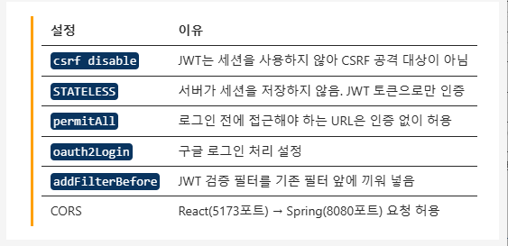

# OAuth2 Backend 작성
## SecurityConfig 작성
- config package에 SecurityConfig.java 파일 생성
- application.properties에 client id / secret 다시 집어넣겠습니다.



## Controller 작성

이후에 어디 부분까지 테스트가 가능했는지, 왜 가능한지 등을 체크하셔야 합니다.

# OAuth2 Frontend 작성

---

## 1. 프로젝트 세팅

```bash
npm install @emotion/react@11.11.1 @emotion/styled@11.11.0 @mui/material@5.14.8 @mui/x-data-grid@6.20.4 @tanstack/react-query@4.43.0 axios@1.13.6 react-router-dom
```

---

## 2. 폴더 구조

```
src
├── api
│   └── authApi.ts
├── store
│   └── authStore.tsx
├── pages
│   ├── HomePage.tsx
│   ├── LoginPage.tsx
│   ├── SignupPage.tsx
│   └── OAuth2CallbackPage.tsx
└── types
    └── auth.ts
```

> `components` 폴더가 아닌 `pages` 폴더를 사용하는 이유:  
> 컴포넌트들의 조합으로 페이지를 만들고, SPA 구조에서 다수의 페이지를 구성하는 경우  
> 폴더명을 `pages`로 구분하는 것이 더 명확하다.

---

## 3. types/auth.ts

```ts
// 일반 객체 구조 → interface 사용
// 복잡한 타입 조합 → type 사용

export interface SignupRequest {
  email: string;
  password: string;
  name: string;
}

export interface LoginRequest {
  email: string;
  password: string;
}

export interface AuthResponse {
  token: string;
  email: string;
  name: string;
}

// localStorage에 저장하는 사용자 정보 (token은 별개로 저장)
export interface UserInfo {
  email: string;
  name: string;
  role: string;
}

// Partial<T> : T의 모든 필드를 선택적(Optional)으로 만들어준다.
export type SignupFormErrors = Partial<SignupRequest>
export type LoginFormErrors = Partial<LoginRequest>

// Context 타입
export interface AuthContextType {
  user: UserInfo | null;
  login: (token: string, userInfo: UserInfo) => void;
  logout: () => void;
  getToken: () => string | null;
  isLoggedIn: boolean;
}
```

### interface vs type

| 구분 | 용도 | 예시 |
|------|------|------|
| `interface` | 객체의 구조를 정의할 때 (주로 사용) | `User`, `LoginRequest` 등 |
| `type` | 유니온, 인터섹션, 유틸 타입 조합 등 복잡한 타입 | `Role`, `FormErrors` 등 |

```ts
// interface 예시
interface User {
  name: string;
  age: number;
}

// type 예시
type Role = "ROLE_USER" | "ROLE_ADMIN"       // 유니온
type ID = string | number;                    // 유니온
type FormErrors = Partial<SignupRequest>      // 유틸 타입 조합
```

---

## 4. api/authApi.ts

```ts
import axios, { AxiosError } from "axios";
import type { SignupRequest, LoginRequest, AuthResponse } from "../types/auth";

// axios 인스턴스 생성 — 공통 설정 적용
const api = axios.create({
  baseURL: 'http://localhost:8080',
  timeout: 10000,
  headers: {
    'Content-Type': 'application/json',
  },
});

// 요청 interceptor — 특정 요청들이 들어왔을 때 사전에 가로채서 작업 수행
api.interceptors.request.use(
  config => {
    const token = localStorage.getItem('jwt_token');
    if (token) {
      config.headers.Authorization = `Bearer ${token}`;
    }
    return config;
  },
  (error: AxiosError) => Promise.reject(error)
);

// 응답 interceptor — 401 시 자동 로그아웃
api.interceptors.response.use(
  response => response,
  (error: AxiosError) => {
    if (error.response?.status === 401) {
      localStorage.removeItem('jwt_token');
      localStorage.removeItem('user_info');
      window.location.href = '/login';
    }
    return Promise.reject(error);
  }
);

// 일반 회원가입
// axios 인스턴스를 위에서 구성했기 때문에 axios.post가 아니라 api.post() 사용
export const signupApi = async (data: SignupRequest): Promise<AuthResponse> => {
  const response = await api.post<AuthResponse>('/api/auth/signup', data);
  return response.data;
}

// 일반 로그인
export const loginApi = async (data: LoginRequest): Promise<AuthResponse> => {
  const response = await api.post<AuthResponse>('/api/auth/login', data);
  return response.data;
}

// 구글 로그인 — redirect 방식이므로 일반 로그인과 다르게 함수만 호출
export const googleLogin = (): void => {
  window.location.href = 'http://localhost:8080/oauth2/authorization/google';
};

export default api;
```

### TS 적용의 실질적인 이점

```ts
// ❌ name 필드가 SignupRequest에 없으므로 VS Code에서 바로 오류 표시
signupApi({ email: 'kim0@test.com', password: '12345678', name: '김영' });

// ✅ 정상 호출
signupApi({ email: 'kim0@test.com', password: '12345678' });

const data = await loginApi({ email: '...', password: '...' });
data.token   // ✅ 정상
// data.toekn  // ❌ 오타 → TS가 즉시 오류 감지
```

> axios 인스턴스(`api`)를 만든 덕분에 모든 요청에 공통 헤더/토큰이 자동으로 붙는다.  
> 매 함수마다 `localStorage.getItem('jwt_token')`을 반복할 필요가 없다.

---

## 5. store/authStore.tsx

### store란?

애플리케이션 상태(state)를 한 곳에 모아서 전역으로 관리하는 폴더.

**필요한 이유**: Props Drilling의 한계를 극복하기 위해.  
로그인 정보나 장바구니처럼 거의 모든 페이지에서 필요한 데이터를  
부모 → 자식 → 손자 순으로 계속 전달하면 대부분의 컴포넌트가 props 매개변수를 요구하게 된다.

**store에 저장되는 상태 예시**
- 로그인한 유저의 프로필 정보
- 현재 사이트 테마 (다크 / 라이트 모드)
- 인증 토큰 (JWT)

```tsx
import { useState, createContext, useContext } from "react";
import type { ReactNode } from "react";
import type { UserInfo, AuthContextType } from "../types/auth";

const TOKEN_KEY = 'jwt_token';
const USER_KEY = 'user_info';

// Context API 사용
const AuthContext = createContext<AuthContextType | null>(null);

// ReactNode: JSX, 문자열, 배열 등 모두 허용하는 React 전용 타입
interface AuthProviderProps {
  children: ReactNode;
}

export function AuthProvider({ children }: AuthProviderProps) {

  const [user, setUser] = useState<UserInfo | null>(() => {
    const savedUser = localStorage.getItem(USER_KEY);
    // JSON.parse() 결과는 기본적으로 any → as UserInfo로 타입 명시
    return savedUser ? (JSON.parse(savedUser) as UserInfo) : null;
  });

  const login = (token: string, userInfo: UserInfo) => {
    localStorage.setItem(TOKEN_KEY, token);
    localStorage.setItem(USER_KEY, JSON.stringify(userInfo));
    setUser(userInfo);
  };

  const logout = (): void => {
    localStorage.removeItem(TOKEN_KEY);
    localStorage.removeItem(USER_KEY);
    setUser(null);
  }

  const getToken = (): string | null => localStorage.getItem(TOKEN_KEY);

  // !! 연산자 : user가 null/undefined면 false, 값이 있으면 true
  // Java로 치면: boolean isLoggedIn = (boolean)user;
  const isLoggedIn: boolean = !!user;

  return (
    <AuthContext.Provider value={{ user, login, logout, getToken, isLoggedIn }}>
      {children}
    </AuthContext.Provider>
  );
}

export function useAuth(): AuthContextType {
  const context = useContext(AuthContext);
  // null이면 AuthProvider 외부에서 사용했다는 의미 → 오류 발생
  if (!context) {
    throw new Error('useAuth는 AuthProvider 내부에서만 사용할 수 있습니다.');
  }
  return context;
}
```

### 핵심 포인트

**`JSON.parse(savedUser) as UserInfo`**
- `JSON.parse()`의 결과는 기본적으로 `any` 타입이다.
- `as UserInfo`로 타입을 명시하면 TS가 해당 결과값을 `UserInfo`로 인식한다.
- 실제로 다른 타입이 들어오면 오류를 발생시켜 개발자가 인지할 수 있다.

**`!!user`**
```ts
const isLoggedIn: boolean = !!user;
// user가 null  → !null  = true  → !!null  = false
// user가 객체  → !객체  = false → !!객체  = true
```

---

## 6. pages

| 페이지 | 역할 |
|--------|------|
| `HomePage` | 메인 화면. 로그인 유저 정보 표시 및 로그아웃 |
| `LoginPage` | 일반 로그인 폼 + 구글 로그인 버튼 |
| `SignupPage` | 회원가입 폼 |
| `OAuth2CallbackPage` | 구글 로그인 후 JWT 수신 및 처리 |

### HomePage.tsx (작성 중)

```tsx
import { Container, Box, Typography, Button, Paper, Chip, Avatar } from "@mui/material"
import LogoutIcon from '@mui/icons-material/Logout';
import PersonIcon from '@mui/icons-material/Person';
import { useAuth } from "../store/authStore";
import { useNavigate } from "react-router-dom";

export default function HomePage() {
  const { user, logout } = useAuth();
  const navigate = useNavigate();

  const handleLogout = (): void => {
    logout();
    navigate('/login');
  }

  // 이후 return 부분 작성 예정

  return (
    <>

    </>
  )
}
```

> `LoginPage` / `SignupPage` / `OAuth2CallbackPage`는 다음 수업에서 작성 예정.

---

## 7. 자주 발생하는 오류 & 실수 모음

### axios 인스턴스 관련

**`axios.post()` 대신 `api.post()` 사용해야 하는 경우**
```ts
// ❌ 직접 axios 사용 시 공통 헤더/인터셉터가 적용 안됨
const response = await axios.post('/api/auth/login', data);

// ✅ 인스턴스 사용
const response = await api.post('/api/auth/login', data);
```

**interceptor에서 토큰 키 이름 불일치**
```ts
// localStorage 저장 시
localStorage.setItem('jwt_token', token);

// interceptor에서 가져올 때 키 이름이 달라지면 토큰이 null
const token = localStorage.getItem('jwt');  // ❌ 키 이름 다름
const token = localStorage.getItem('jwt_token');  // ✅
```

---

### Context API 관련

**`useAuth()`를 `AuthProvider` 외부에서 사용**
```tsx
// ❌ AuthProvider로 감싸지 않은 컴포넌트에서 사용하면 오류
function App() {
  const { user } = useAuth(); // Error: useAuth는 AuthProvider 내부에서만 사용 가능
}

// ✅ AuthProvider로 감싸야 함
function App() {
  return (
    <AuthProvider>
      <HomePage />
    </AuthProvider>
  );
}
```

**`createContext`의 초기값 타입 불일치**
```tsx
// ❌ 타입 없이 생성하면 null 체크 없이 사용 시 오류
const AuthContext = createContext(null);

// ✅ 제네릭으로 타입 명시
const AuthContext = createContext<AuthContextType | null>(null);
```

---

### TypeScript 관련

**`JSON.parse()` 결과를 그대로 사용**
```ts
// ❌ JSON.parse() 결과는 any → TS 타입 안정성 없음
const savedUser = JSON.parse(localStorage.getItem(USER_KEY));

// ✅ as로 타입 명시
const savedUser = JSON.parse(localStorage.getItem(USER_KEY)) as UserInfo;
```

**interface와 type 혼용**
```ts
// ❌ 객체 구조에 type 사용 (틀린 건 아니지만 일관성 깨짐)
type LoginRequest = {
  email: string;
  password: string;
}

// ✅ 이번 프로젝트 기준 — 객체 구조는 interface
interface LoginRequest {
  email: string;
  password: string;
}
```

---

## 오늘 학습 요약

1. **폴더 구조** — `components` 대신 `pages` / `store` / `api` / `types` 분리
2. **axios 인스턴스** — `axios.create()`로 공통 설정, interceptor로 토큰 자동 처리
3. **interceptor** — 요청 시 토큰 자동 삽입, 응답 401 시 자동 로그아웃
4. **Context API** — `AuthProvider`로 전역 인증 상태 관리, `useAuth()`로 사용
5. **`!!user`** — null/undefined → false, 값 있음 → true 변환
6. **`as UserInfo`** — `JSON.parse()` 결과에 타입 명시
7. **interface vs type** — 객체 구조는 interface, 나머지는 type